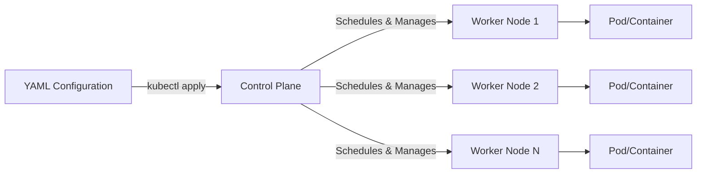

# Kubernetes Essentials - [https://kubernetes.io/](https://kubernetes.io/)

## The Problem: Container Chaos
Before Kubernetes, managing multiple Docker containers meant:
- **Manual Management:** Manually deploying and tracking containers.
- **Connectivity Issues:** Containers were isolated and didn't know about each other.
- **Load Balancing:** Manual setup of load balancers to distribute traffic across multiple instances of the same app.
- **Scaling Pain:** High manual effort to scale workloads up or down.

## The Solution: Kubernetes (K8s)
Kubernetes acts as the **"Operating System of the Cloud."** It manages a cluster of Virtual Machines (called **Worker Nodes**) and coordinates them via a **Control Plane**.

### Key Concepts:
- **Declarative State:** Instead of manual commands, you use **YAML files** to define the "desired state" (e.g., "I want 3 replicas of this app"). Kubernetes automatically works to make the actual state match this desired state. You apply these files with `kubectl` — see [kubectl](kubectl.md).
- **Automated Scheduling:** The Control Plane decides which Worker Node should run a container based on available resources.
- **Intelligent Scaling:**
    - **Scheduled Scaling:** Scale based on known time patterns.
    - **Metric-based Scaling:** Scale automatically based on CPU, memory, or request volume.
- **Scalability:** Effortlessly run container workloads at massive scale.

## Workflow: From Config to Cluster

## Pods

The smallest unit created on a cluster — but it's more than a container: a Pod is a **group** of containers that share networking and storage, though it can also consist of a single container.

- Create and manage Pods with `kubectl` — see [kubectl](kubectl.md).
- Pods are usually managed through a **Deployment** so they stay running and can be scaled — see [Deployments](deployments.md).
